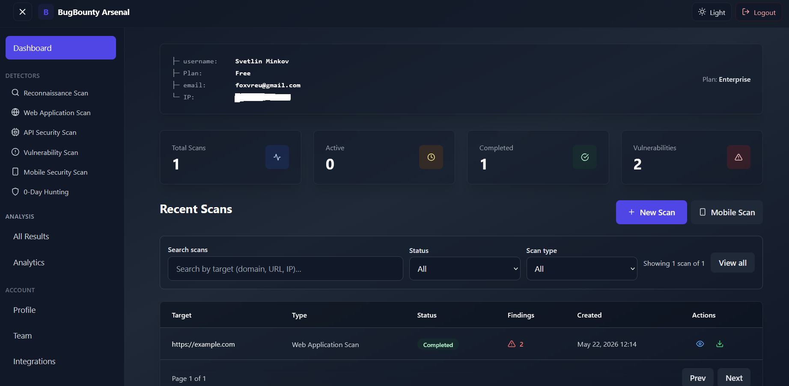
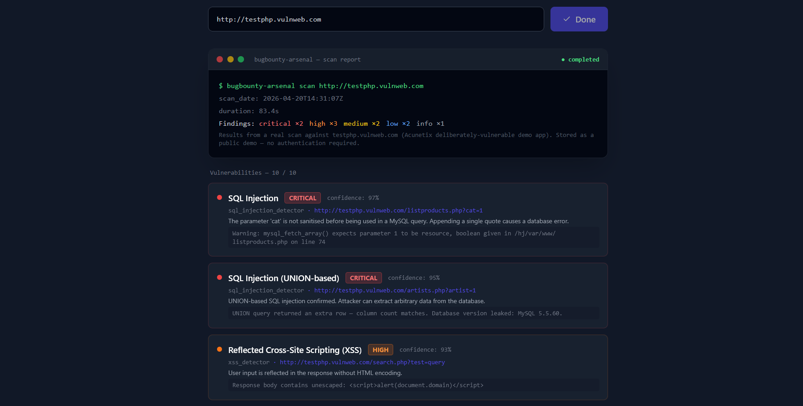
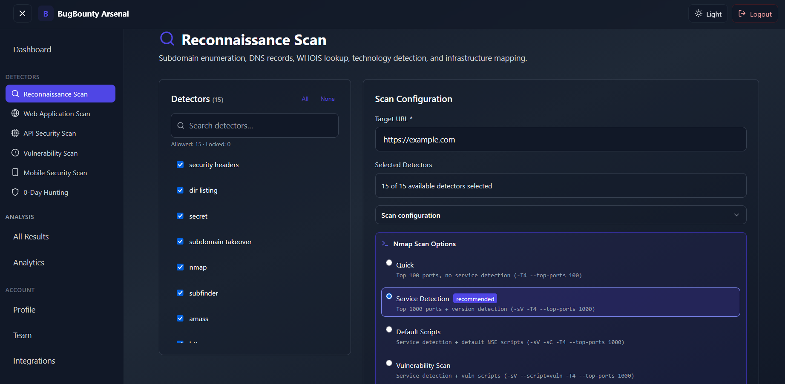

# BugBounty Arsenal Resources

Curated workflows, tools and references for bug bounty hunters and web security researchers.

---

## What is BugBounty Arsenal?

BugBounty Arsenal is a practical web testing platform focused on recon workflows, endpoint discovery and security testing utilities.

The goal is to simplify repetitive web testing tasks without requiring complex local setups.

---

## Features

- Recon workflows
- Endpoint discovery
- Subdomain enumeration
- Fuzzing support
- Reporting tools
- Web testing utilities

---

## Live Demo

https://bugbounty-arsenal.com

Demo scans are available without registration.

Accounts are only required for saving scan history and workflows.

---

## Screenshots

### Dashboard

### Demo Scan

### Recon Workflow

---

## Roadmap

See:
[ROADMAP.md](ROADMAP.md)

---

## Contributing

Contributions, suggestions and workflow improvements are welcome.

See:
[CONTRIBUTING.md](CONTRIBUTING.md)

---

## Disclaimer

For authorized security testing and educational purposes only.
